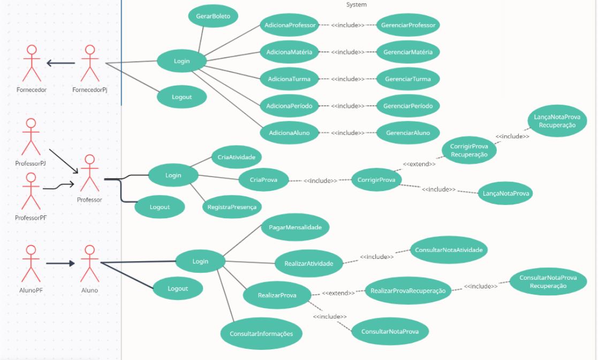
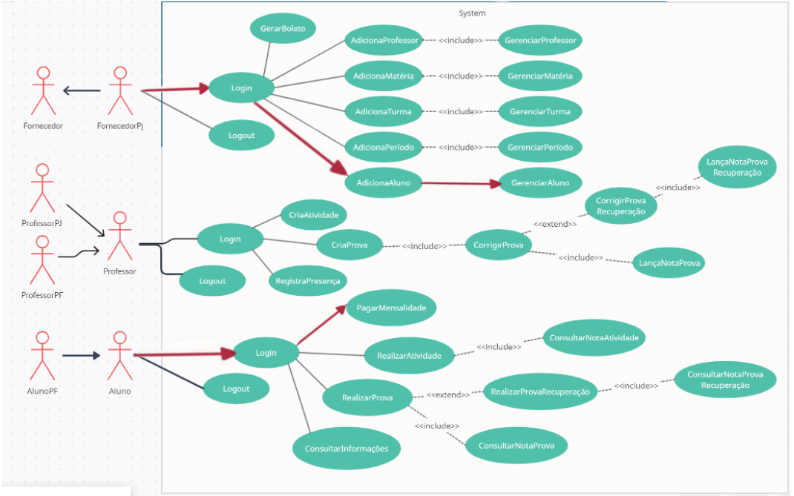
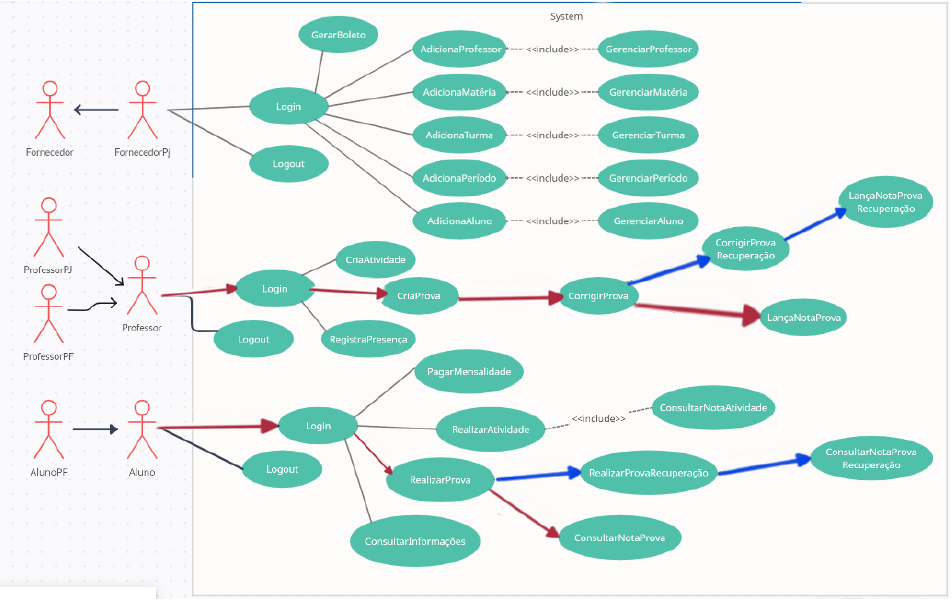
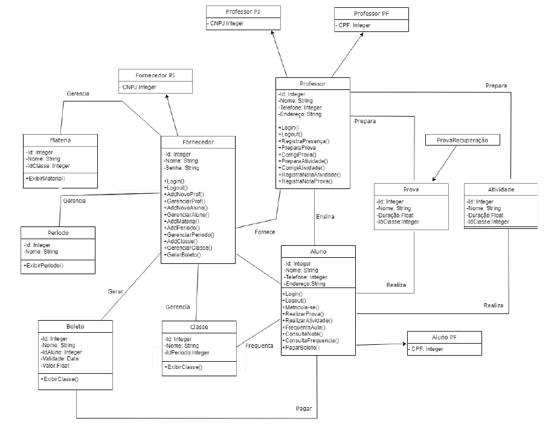
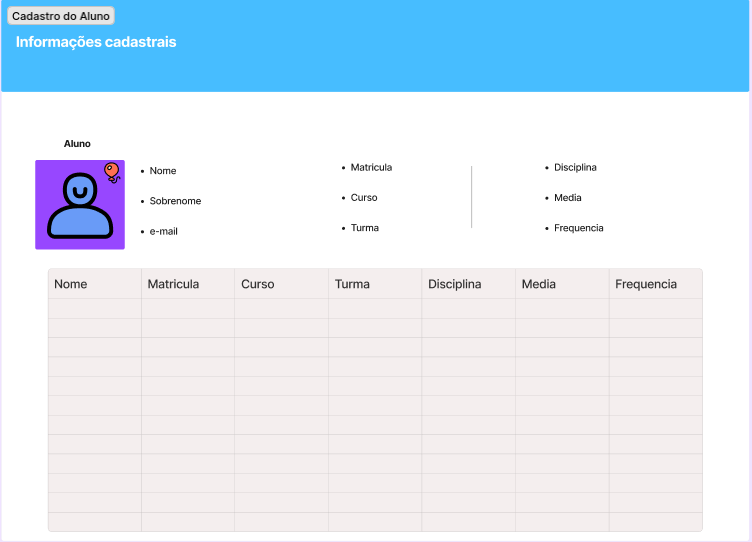
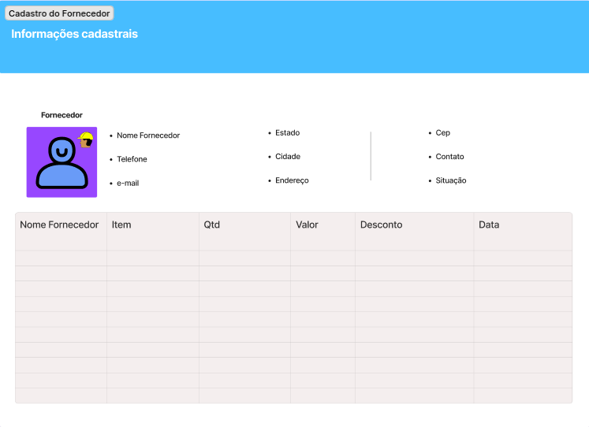
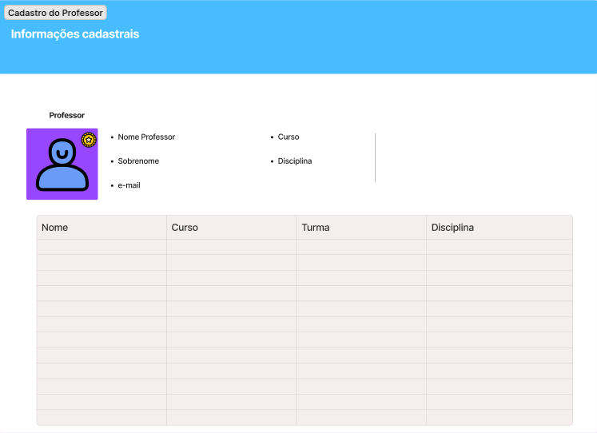
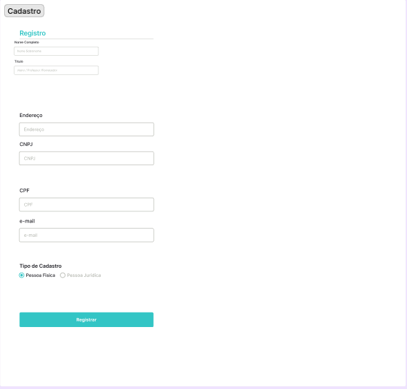

2_Entrega_PI_Grupo_15

# CENTRO UNIVERSITÁRIO SENAC

Disciplina: Projeto Integrador III - Grupo 15

DESENVOLVIMENTO DE SISTEMAS ORIENTADO A OBJETOS

São Paulo

2022

CENTRO UNIVERSITÁRIO SENAC

Disciplina: Projeto Integrador II

Ana Beatriz de Araújo

Eduardo Luís Ferreira Reis

Gabriel Henrique Batista de Souza

Karoline Vitoria Silva Rabello

Larissa Lima de Andrade

DESENVOLVIMENTO DE SISTEMAS ORIENTADO A OBJETOS

​																																				Projeto Integrador III – Fase 1 apresentado ao

​																																					Centro Universitário Senac, como exigência

​																																													parcial para obtenção de

​																																			aprovação na disciplina Projeto Integrado III, do

​																																									curso de Graduação Senac EAD.

São Paulo

2022

### DIAGRAMA DE CASO DE USO

### CENÁRIOS DO CASO DE USO
Nome do cenário: Matrícula
Ator: Aluno, Fornecedor PJ
Pré-condição: Ser administrador do sistema

Fluxo normal:

1. Aluno realiza matrícula
2. Fornecedor gera cadastro do aluno
2. Fornecedor gerencia aluno
3. Aluno paga mensalidade
4. Aluno frequenta aula
- Fluxo alternativo: Aluno não paga mensalidade
- Fluxo alternativo: Sistema fora do ar
- Pós-condição: Aluno é cadastrado, aluno frequenta curso

Nome do cenário: Aprovação Aluno
Ator: Professor, Aluno, Fornecedor
Pré-condição: Realizar Matrícula e Realizar Login
Fluxo normal:
1. Aluno realiza login
2. Aluno realiza matrícula
3. Fornecedor cadastra aluno
4. Aluno paga mensalidade
5. Aluno frequenta aula
6. Professor registra frequência
7. Professor prepara a atividade
8. Aluno realiza atividade
9. Professor registra nota
10. Aluno consulta nota
11. Professor prepara prova
12. Aluno realiza prova
    13.Professor corrigi a prova
    14.Professor registra nota
    12.Aluno consulta nota
    13.Fornecedor gerencia aluno
    14.Sistema consulta se aluno obteve frequência mínima
    15.Sistema consulta se aluno obteve nota mínima
    16.Sistema aprova aluno
    - Fluxo alternativo: Aluno não obteve a média necessária
      12.1 Aluno Realiza Prova Recuperação
      Pós-condição: Aluno conclui o curso

### DIAGRAMA DE CLASSE

### Protótipos

## Link para o protótipo no [figma]( https://www.figma.com/file/hTyii64XT4fgXgjKJYFtZ8/Sistema-de-Cadastro-Escolar?type=whiteboard&node-id=0%3A1&t=VJz9irrf9T0jDKzX-1)

